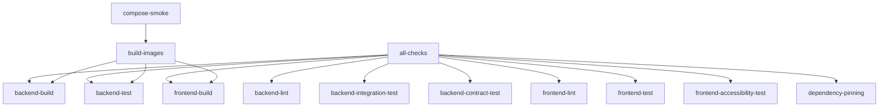

# CI Quality Gate Validation

This document provides validation scenarios for testing the CI quality gates implemented for BC09-004.

## Quality Gate Requirements

The CI pipeline enforces these quality gates:

### Required Checks (Must Pass)
1. **backend-lint** - Backend code formatting
2. **backend-build** - Backend compilation
3. **backend-test** - Backend unit tests
4. **frontend-lint** - Frontend code style
5. **frontend-build** - Frontend build
6. **dependency-pinning** - Dependency version validation

### Optional Checks (Non-Blocking, Informational)
7. **backend-integration-test** - PostgreSQL integration tests
8. **backend-contract-test** - Pact contract tests
9. **frontend-test** - Frontend unit tests
10. **frontend-accessibility-test** - axe-core accessibility scans

## Validation Scenarios

### Scenario 1: All Checks Pass
**Expected:** Merge allowed, green status

**Setup:**
- All code properly formatted
- All tests passing
- Dependencies pinned correctly
- Build succeeds

**Result:** ✅ CI quality gate PASSED - ready to merge

---

### Scenario 2: Required Check Fails - Backend Lint
**Expected:** Merge blocked, red status

**Setup:**
```java
// Introduce formatting violation
public class Example{
    void badFormatting( ){
        // Missing spaces
    }
}
```

**Result:** ❌ CI quality gate FAILED - merge blocked

**Fix:** Run `./mvnw spotless:apply` to fix formatting

---

### Scenario 3: Required Check Fails - Backend Build
**Expected:** Merge blocked, red status

**Setup:**
```java
// Introduce compilation error
public class Example {
    void method() {
        String x = 5; // Type mismatch
    }
}
```

**Result:** ❌ CI quality gate FAILED - merge blocked

**Fix:** Correct the compilation error

---

### Scenario 4: Required Check Fails - Backend Unit Tests
**Expected:** Merge blocked, red status

**Setup:**
```java
@Test
void shouldFail() {
    assertEquals(1, 2); // Failing assertion
}
```

**Result:** ❌ CI quality gate FAILED - merge blocked

**Fix:** Fix the failing test

---

### Scenario 5: Optional Check Not Yet Implemented
**Expected:** Merge allowed, informational warning

**Setup:**
- No integration tests exist yet
- Maven profile returns non-zero exit

**Result:** ✅ CI quality gate PASSED - ready to merge
```
⚠️  Optional checks not yet passing (non-blocking):
  - backend-integration-test
  - backend-contract-test
  - frontend-test
  - frontend-accessibility-test

These checks are expected to fail until their test infrastructure is implemented.
```

---

### Scenario 6: Dependency Not Pinned
**Expected:** Merge blocked, red status

**Setup:**
```json
{
  "dependencies": {
    "vue": "^3.5.25"  // Using caret (unpinned)
  }
}
```

**Result:** ❌ CI quality gate FAILED - merge blocked

**Fix:** Remove caret/tilde prefixes:
```json
{
  "dependencies": {
    "vue": "3.5.25"  // Exact version
  }
}
```

---

### Scenario 7: Frontend Build Fails
**Expected:** Merge blocked, red status

**Setup:**
```typescript
// Invalid TypeScript/JavaScript syntax
const x = ;
```

**Result:** ❌ CI quality gate FAILED - merge blocked

**Fix:** Correct the syntax error

---

### Scenario 8: Integration Tests Fail After Implementation
**Expected:** Merge allowed (optional check)

**Setup:**
- Integration tests have been implemented
- One test fails

**Current Behavior:** ⚠️ Non-blocking warning

**Note:** Once integration test infrastructure is mature, this will become a required check. For now, it's informational to allow incremental implementation.

---

## Testing the Gates Locally

### Run All Required Checks
```bash
# Backend lint
cd apps/backend && ./mvnw verify -Dformat.validate

# Backend build
cd apps/backend && ./mvnw clean package -DskipTests

# Backend tests
cd apps/backend && ./mvnw test

# Frontend lint
cd apps/frontend && npm run lint

# Frontend build
cd apps/frontend && npm run build

# Dependency pinning (manual check)
grep -E '"\^|"~' apps/frontend/package.json
```

### Run Optional Checks
```bash
# Integration tests
cd apps/backend && ./mvnw verify -Pintegration

# Contract tests
cd apps/backend && ./mvnw verify -Pcontract

# Frontend tests
cd apps/frontend && npm test

# Accessibility tests
cd apps/frontend && npm run test:a11y
```

### Simulate CI Locally
```bash
# Using Make
make lint && make build && make test

# Or manually
cd apps/backend && ./mvnw verify -Dformat.validate && ./mvnw test
cd apps/frontend && npm run lint && npm run build
```

---

## CI Job Dependencies



---

## Troubleshooting

### "associative array not supported in this bash version"
**Cause:** Using bash 3.x (default on macOS)

**Fix:** The CI uses Ubuntu with bash 4+. The associative arrays in the all-checks job are supported.

### Integration tests fail with "profile not found"
**Cause:** Maven profile not activated

**Fix:** Use `-Pintegration` flag: `./mvnw verify -Pintegration`

### Frontend tests fail with "command not found"
**Cause:** Test scripts not yet implemented

**Expected:** This is normal until test infrastructure is configured. The CI treats these as optional checks.

### Docker Compose smoke test fails
**Cause:** Services not healthy or .env file missing

**Fix:** 
1. Ensure all services are defined in docker-compose.yml
2. Create .env file with required secrets
3. Wait for health checks to pass

---

## Future Enhancements

### Phase 1 (Current)
- [x] Required checks enforce core quality
- [x] Optional checks are informational
- [x] Clear reporting of status

### Phase 2 (After Test Infrastructure)
- [ ] Promote integration tests to required
- [ ] Promote contract tests to required for API changes
- [ ] Promote accessibility tests to required for UI changes
- [ ] Add code coverage reporting
- [ ] Add mutation testing

### Phase 3 (Advanced)
- [ ] Changed file detection for conditional checks
- [ ] Parallel test execution
- [ ] Test result caching
- [ ] Flaky test detection
- [ ] Performance regression detection

---

## References

- [Testing Strategy](./TESTING_STRATEGY.md)
- [BC09-004 Issue](../pdd/implementation/issues/bc09-operability-hardening-and-quality.issues.yaml)
- [Implementation Plan Step 25](../pdd/implementation/plan.md)
- [CI Workflow](../.github/workflows/ci.yml)
