Version: v2 (2026-02-01)

# RegattaDesk v0.1 Detailed Design

## Overview
RegattaDesk is a regatta management system for rowing head races (single distance) that supports:
- staff workflows (entries, draw, bibs, jury, finance),
- operator workflows (start/finish timekeeping with line-scan camera UI, offline-capable),
- a high-traffic public read site with cacheable pages and live updates.

Backend: Quarkus (Java) + Postgres. Frontend: Vue.
Architecture adopts Event Sourcing + projections for read models and public delivery.
API-first for all operations; staff/operator/public clients consume the same API surface (imports can be external tools later).

## Detailed Requirements
(See idea-honing.md for consolidated requirements. This design is standalone, but references the same decisions.)

### Functional
- Terminology (glossary; use consistently in this doc):
  - Category: demographic grouping (age/gender/skill level).
  - Boat type: shell/rigging type (e.g., 1x, 2x, 2-, 4+, 8+).
  - Event: a Category × Boat type pairing; primary unit for entries, scheduling, and results.
  - Event group (optional): named grouping of events for awards or schedule organization (avoid using “class” as a standalone term).
  - Block: operational scheduling unit with an ordered list of events.
- Regatta setup: events (with optional event grouping), blocks, bib pools (multiple per block), overflow pool, display prefs (per-entry vs block-only start time), penalties (seconds configurable per regatta), ruleset selection.
- Regatta state lifecycle: draft → published (draw published) → archived → deleted.
- Blocks: schedule start time plus interval between crews and interval between events (block-level config).
- Regatta end definition (for retention windows): use explicit regatta_end_at timestamp when set; otherwise compute from the latest block’s scheduled end time.
- Scheduled start time (deterministic):
  - per-entry scheduled_start = block_start + (event_index * event_interval) + (crew_index_within_event * crew_interval)
  - indices are zero-based in draw order; event order is the block’s event sequence, crew order is the event draw order
- Block scheduled end time (best practice): block_end = last_scheduled_start + crew_interval.
  - Equivalent formula for final crew: block_end = block_start + (event_index * event_interval) + (crew_index_within_event * crew_interval) + crew_interval
- Entries/crews/athletes: CRUD via API; crew reusable across regattas; entry is regatta-scoped participation.
  - Club fields: id, name, short_name.
  - Athlete fields: full name, DOB, gender, club, optional federation id.
    - Federation ID format: alphanumeric, max 20 chars; optional field for national federation integration.
    - API for searching athletes by federation ID: GET /api/v1/athletes?federationId={id}.
  - Crew fields: display name; explicit club assignment when provided, otherwise derived from athletes; list of athletes + seat order.
    - Derived club rule: if all athletes share the same club, use that club; otherwise mark crew as composite/multi-club.
  - Entry fields: bib, start position, status.
- Events: category × boat type; may be grouped into event groups per regatta.
- Rulesets: versioned; can be duplicated and updated; global rulesets immutable once linked to a regatta with a published draw; regatta cannot change ruleset after draw; age calculation config (actual age at start vs age as of Jan 1).
  - Only super_admin can promote regatta-owned rulesets to global selection.
  - Validation checks: gender compatibility and min/max age constraints.
- Finance: payment_status enum (v0.1) is `unpaid` or `paid` only (no partial/refund support); default is `unpaid`.
  - Payment amount configuration: entry fee is configurable per regatta (default €0.00); stored in regatta configuration.
  - Club-level billing: configurable billing contact and invoicing details per club.
  - Entry-level status is the source of truth.
  - Club “paid/unpaid” is a bulk action that updates entries with audit events.
  - Club status is derived from current entry statuses (paid only if all current billable entries are `paid`; otherwise `unpaid`).
  - Optional payment metadata fields: paid_at, paid_by, payment_reference.
  - Billing club source of truth: entry.billing_club_id when set; otherwise crew’s club (single-club crews only).
  - Composite/multi-club crews require explicit billing_club_id (and remain labeled as composite for reporting).

### Payment Workflow

#### Invoice Generation Flow
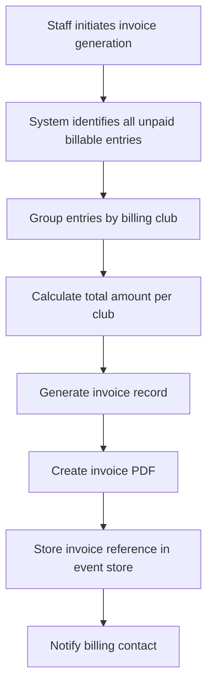

#### Invoice Schema
```json
{
  "id": "uuid",
  "regatta_id": "uuid",
  "club_id": "uuid",
  "invoice_number": "string",
  "entries": [{"entry_id": "uuid", "amount": number}],
  "total_amount": number,
  "currency": "string",
  "status": "draft|sent|paid|cancelled",
  "generated_at": "timestamp",
  "sent_at": "timestamp",
  "paid_at": "timestamp"
}
```

#### Payment Reconciliation Process
1. Manual payment entry: Staff records payment details via API
2. System validates: invoice exists, amount matches
3. Update payment status: mark entries as `paid`
4. Audit event: record who marked paid, when, payment reference
5. Update club status: recalculate based on all entries

#### Refund Handling
- **Refunds are NOT supported in v0.1**
- Manual workarounds require admin intervention and database access
- Future consideration: credit notes system for post-v0.1

#### Payment API Endpoints
| Method | Path | Description |
|--------|------|-------------|
| GET | /api/v1/regattas/{id}/invoices | List invoices (paginated) |
| POST | /api/v1/regattas/{id}/invoices/generate | Generate invoices for unpaid entries |
| GET | /api/v1/regattas/{id}/invoices/{invoiceId} | Get invoice details |
| POST | /api/v1/regattas/{id}/invoices/{invoiceId}/mark-paid | Mark invoice as paid |
| GET | /api/v1/regattas/{id}/entries/{entryId}/billing | Get billing details for entry |

- Draw: random v0.1, stored seed for reproducibility, publish increments draw_revision; no insertion after draw; events start sequentially but finishes can interleave.
  - Bib pools are immutable after draw publish. To change pools, unpublish draw first.
  - Draw generation uses the bib pool allocation algorithm. If a pool is exhausted, continue to the next pool. If overflow is exhausted, throw error.
- Bibs: regatta-wide unique; collision resolution assigns next available bib to changing entry; missing bib replacement affects only that entry; default assignment direction (smallest/largest) configurable per regatta (no per-pool override in v0.1); blocks can have multiple bib pools; overflow pool usage bounded by physical inventory.
  - Pools/overflow must be defined as non-overlapping inclusive numeric ranges (or explicit lists); validate uniqueness across all pools at setup.
  - Allocation priority: use the entry’s block primary pool first, then additional block pools in configured order, then overflow.
  - Next available bib = first unused number in the current pool when scanning in the configured direction; if exhausted, continue to the next pool in priority order.
  - Overflow pool is regatta-level and shared across all blocks; any block may borrow from it.
- Timing: line-scan markers create/move/delete; link/unlink to bib; immutability after approval.
  - UI: overview strip plus draggable detail window for fine alignment at start/finish.
  - Selecting an unlinked marker recenters the detail view on that marker.
  - Capture metadata: recording start time + fps; compute time from frame offset.
  - Recording start time sourced via device time sync at session start (server handshake/NTP); store server_time_at_start plus device monotonic offset.
  - Drift handling: periodic resync; apply offset correction; if drift exceeds threshold, flag the capture session for review.
  - Fallback: if device time is invalid or sync fails, mark the capture session as unsynced and require manual timestamp correction before approvals (server-received timestamps are provisional only).
  - Time storage (best practice): regatta.time_zone stored as IANA TZ name (e.g., `Europe/Amsterdam`); store timestamps in UTC (Instant) and display in regatta-local time zone.
  - Marker metadata: timestamp, capture device id, image tile reference (tile coords/ids).
  - Tile defaults (best practice): 512x512 WebP lossless tiles with PNG fallback; manifest includes tile size, origin, and x-coordinate -> timestamp mapping.
  - Unlinked marker create/delete is not audited.
  - Link/unlink actions and edits to linked markers are always audited.
  - Pre-approval deletes of linked markers emit audit events.
  - Linked markers become immutable after approval.
  - Retention: keep full line scan during regatta; after configured delay (default 14 days after regatta end, configurable per regatta) prune to ±2s around approved markers. (Regatta end defined above.)
    - Do not prune until the regatta is archived or all entries are approved.
    - If the retention delay elapses first, keep the full scan and raise an admin alert.
  - Result calculation: use actual start + finish markers only (no scheduled-time fallback).
  - Public results ordering (best practice):
    - Rank by elapsed time including penalties.
    - Ties share rank.
    - Tie-breaker order for display: 1) elapsed time (tie), 2) start time, 3) bib number, 4) crew name alphabetically.
    - Non-finish statuses (dns/dnf/dsq/excluded/withdrawn) appear after ranked entries.
  - If a start/finish marker is missing, approval is blocked until the marker is added or the entry is set to DNS/DNF/DSQ/Excluded.
  - Timing precision: store milliseconds.
  - Default display precision: milliseconds (`.mmm`).
  - Rounding rule: round half-up to the configured precision for display; ranking uses actual (unrounded) time.
  - Elapsed-time format: `M:SS.mmm` (or `H:MM:SS.mmm` when ≥1h).
  - Scheduled-time format: `HH:mm` (24h).
  - Public results Delta: time behind leader, computed from unrounded times then rounded for display; format `+M:SS.mmm` (or `+H:MM:SS.mmm` when ≥1h).
  - Leader delta displays as `+0:00.000` (rounded) so the UI never shows a blank delta.
- Operator workflow: global queue across blocks (not necessarily draw order); marker→bib linking with quick correction; DNS batch warnings before bulk changes.
- Jury: investigations per entry; outcomes include no action, penalty seconds (configurable per regatta via penalty configuration), excluded, DSQ (entry); approvals gate.
  - Multiple investigations per entry allowed; closure is per investigation.
  - Penalty seconds are added to computed elapsed time for ranking and delta; raw timing data is retained for audit.
  - Penalty configuration (`defaultPenaltySeconds`, `allowCustomSeconds`) is set at the regatta level and used when assigning penalties via investigations.
  - "No action" closes the investigation; workflow: 1) Close investigation with outcome=no_action, 2) System checks if timing is complete, 3) If yes and no other open investigations, auto-approve entry, 4) If no, entry returns to pending_approval.
  - Tribunal escalation is modeled by re-opening an investigation.
  - Not all entries in a single investigation must receive penalties.
  - Best practice: regatta-wide DSQ is modeled as a bulk action applying DSQ (entry) to all affected entries, with per-entry audit events.
- Approvals/results: entry completion criteria, event approval gating (withdrawn entries excluded), DSQ as a canonical status with explicit revert event storing prior status in metadata; result labels provisional/edited/official.
  - Entry completion: finish time set OR status dns/dnf/dsq/excluded and not under investigation.
  - Entry approval is explicit (head_of_jury or regatta_admin):
    - When timing is complete and there are no open investigations, entry becomes “pending approval”.
    - Approving an entry marks it `approved/immutable` and locks linked markers.
  - Event cannot be approved unless every non-withdrawn entry is in approved/dns/dnf/dsq/excluded state.
  - withdrawn_before_draw entries are excluded from public schedule/results entirely; show only in staff views with filters/audit history.
  - withdrawn_after_draw entries remain visible on staff/public schedules and results with a withdrawn status label; they are excluded from rankings and approvals.
  - If a required start/finish marker is missing, approval is blocked unless the entry is set to DNS/DNF/DSQ/Excluded.
  - Result labels:
    - provisional: computed but not event-approved
    - edited: manual adjustment or penalty applied (still provisional until approval)
    - official: event approved
- Public: cacheable versioned paths with draw/results revision keys; /versions no-store; SSE ticks and snapshot.
  - Schedule/start order content depends only on draw_revision, even though cache keys include both revisions.
  - Revision bump rules (best practice):
    - draw_revision: draw publish + any schedule/start-order/bib display change
    - results_revision: marker/time edits, penalties, approvals, DNS/DNF/DSQ/excluded changes
    - if a single operation affects both schedule/start-order/bib display and result-affecting data, increment both together

### Status taxonomy
- Domain status values: active, withdrawn_before_draw, withdrawn_after_draw, dns, dnf, excluded, dsq.
  - `excluded` - entry was disqualified from the race (not the same as DSQ which is entry-level ban).
- Derived workflow/UI states: under_investigation, approved/immutable, offline_queued, provisional/edited/official.

### Non-functional
- Operator offline: queued actions; sync with explicit conflict policy.
  - Queue data structure: array of {action, timestamp, deviceId, metadata} objects.
  - **Queue size limits**: Max 1000 actions per device; oldest actions evicted when limit exceeded.
  - **Retry strategy for sync failures**:
    - Exponential backoff: 1s, 2s, 4s, 8s, 16s, 32s, capped at 60s
    - Max retry attempts: 10 per action batch
    - After max retries: mark batch as "failed", UI shows sync error state
    - User can manually retry failed batches
  - **Offline duration tracking**:
    - Track offline_start_timestamp when connection lost
    - Track last_successful_sync_timestamp
    - Display offline duration in UI when disconnected
    - Flag for admin review if offline duration > 1 hour
  - Sync endpoint: POST /api/v1/regattas/{id}/operator/sync (accepts queued actions, returns conflicts).
  - Conflict resolution: last-write-wins for marker position/time adjustments and unlinking when entry is not approved; auto-accept link if entry has no linked marker at that station and marker is not linked elsewhere.
  - Manual resolution required: duplicate links (entry already linked to a different marker), marker linked to a different entry, or any edits against approved/immutable entries (reject and surface conflict).
  - Conflict resolution API: GET /api/v1/regattas/{id}/operator/conflicts returns pending conflicts with resolution options.
- High read scalability: CDN caching + versioned paths + SSE ticks.
- Containerized deployment + automated pipeline (CI/CD).
- Observability: health + OpenTelemetry + metrics.
- Audit: event sourcing + immutable log.

### Out of scope (v0.1)
- Side-by-side racing, multi-distance, handicap/conversion factors (beyond “winner time” ranking).
- OCR bib recognition.
- Built-in CSV import UI (API-only; import tools later).

## Architecture Overview

```mermaid
flowchart LR
  subgraph Clients
    Staff[Staff Web (Vue)]
    Ops[Start/Finish Operator PWA (Vue)]
    Public[Public Web (Vue)]
  end

  subgraph Edge
    CDN[CDN/Cache]
    SSE[SSE Gateway (HTTP)]
  end

  subgraph Backend[Quarkus Backend]
    API[REST API]
    CMD[Command Handler]
    ES[Event Store (Postgres)]
    PROJ[Projectors]
    RM[(Read Models / Projections)]
    OBJ[(Object Storage: tiles + manifests)]
  end

  Staff --> API
  Ops --> API
  Public --> CDN --> API
  Public --> SSE --> API

  API --> CMD --> ES
  ES --> PROJ --> RM
  API --> RM

  Ops --> OBJ
  API --> OBJ
```

## Frontend UX and design system
- v0.1 style and component specs are defined in `style-guide.md`.
- Design system approach:
  - CSS variables as the canonical token layer.
  - Headless Vue components for reuse across Staff/Operator/Public.
  - Theme/density controlled via `<html>` attributes (e.g. `data-contrast`, `data-density`).
- Public accessibility target: WCAG 2.2 AA minimum; aim AAA where feasible for key schedule/results flows.
- Staff accessibility: no hard requirement, but avoid obviously inaccessible patterns (focus visibility, contrast, touch targets).
- Internationalization and formatting:
  - Initial locales: Dutch (`nl`) and English (`en`).
  - Time: 24h.
  - Dates: `dd-MM-yyyy`.
  - Time zone: regatta-local (future may add viewer-local toggle).
- Printing:
  - Admin generates printables as A4 PDFs; monochrome-friendly output.
  - **PDF library selection**: OpenPDF (LGPL) for Java backend; supports A4, monochrome output, custom fonts.
  - **Async job status polling**:
    - Endpoint: `POST /api/v1/regattas/{id}/export/printables` returns `{jobId: "uuid"}`
    - Status polling: `GET /api/v1/jobs/{jobId}` returns `{status: "pending|processing|completed|failed", downloadUrl?, error?}`
    - Job expires after 24 hours
  - **Print template specifications**:
    - Page size: A4 (210mm x 297mm)
    - Margins: 20mm top/bottom, 15mm left/right
    - Header (per page): regatta name, generated timestamp, draw/results revisions, page number
    - Font: Liberation Sans (free, readable)
    - Monochrome: Grayscale only, minimum 300 DPI
    - Content sections: draw list, results, entries by event
  - Print generation: async processing via background queue (for large regattas).
- Operator UX constraints:
  - Must remain usable on iPhone SE class devices.
  - Must support outdoor readability via high contrast and larger touch targets.
  - Default to high-contrast mode with a toggle back to standard; persist preference per device (LocalStorage).
  - Density toggle: persist per device via LocalStorage (compact/dense modes).
  - PIN/token flows must not interrupt active capture UI.

## Components and Interfaces
- Staff API: Auth0 JWT, regatta-scoped roles (+ super_admin).
  - Auth0 configuration:
    - Tenant: configured via environment variable
    - Audience: `https://api.regattadesk.com`
    - Role claim format: `https://regattadesk.com/roles` array in JWT token
    - Token refresh: automatic via Auth0 SDK; refresh token rotation enabled
  - Regatta roles: regatta_admin, head_of_jury, info_desk, financial_manager; super_admin is global.
  - Permissions matrix (best-practice defaults):
  
  | Action | regatta_admin | head_of_jury | info_desk | financial_manager | operator | super_admin |
  | --- | --- | --- | --- | --- | --- | --- |
  | Create/update regatta | Yes | No | No | No | No | Yes |
  | Create/update events | Yes | No | No | No | No | Yes |
  | Create/update blocks | Yes | No | No | No | No | Yes |
  | Manage bib pools | Yes | No | No | No | No | Yes |
  | Create/update entries | Yes | No | Yes | No | No | Yes |
  | Create/update crews/athletes | Yes | No | Yes | No | No | Yes |
  | Publish draw | Yes | No | No | No | No | Yes |
  | Approve entry | Yes | Yes | No | No | No | Yes |
  | Approve event | Yes | Yes | No | No | No | Yes |
  | Mark DNS | Yes | Yes | No | No | Yes (within scoped block) | Yes |
  | Mark DNF | Yes | Yes | No | No | No | Yes |
  | Mark withdrawn_before_draw | Yes | No | Yes | No | No | Yes |
  | Mark withdrawn_after_draw | Yes | Yes | Yes | No | No | Yes |
  | Mark paid/unpaid | Yes | No | No | Yes | No | Yes |
  | Create investigations | Yes | Yes | No | No | No | Yes |
  | Assign penalties | Yes | Yes | No | No | No | Yes |
  | Close investigations | Yes | Yes | No | No | No | Yes |
  | View audit logs | Yes | No | No | No | No | Yes |
  | Export printables/PDFs | Yes | No | No | No | No | Yes |
  | Manage operator tokens | Yes | No | No | No | No | Yes |
  | Revoke operator access | Yes | No | No | No | No | Yes |
- Operator API: QR token scoped to block(s), station, validity window, revocable; operators are accountless (QR/token only).
  - Station model: single active station per token; second device can request access without interrupting active station.
  - Handoff: new device shows a PIN; active station can reveal the matching PIN to complete handover.
  - After PIN handover, the previous device is demoted to read-only and must re-auth to regain control.
  - Admin can view PIN remotely only if the active station cannot access the PIN flow.
  - Token display must not interrupt capture UI (hidden unless opened intentionally).
  - QR tokens exportable to PDF with fallback instructions (short URL + token/PIN) if QR scan fails.
- Public:
  - POST /public/session (204) mints/refreshes anon HttpOnly JWT cookie (HS256; iss/aud; kid rotation).
    - If missing/invalid anon cookie: mint a new one.
    - If valid and within refresh window: refresh (new Set-Cookie).
    - If valid and outside refresh window: 204 with no Set-Cookie.
    - Sliding TTL 5 days; refresh window 20% of TTL.
    - Key rotation: two active keys; overlap ≥6 days.
    - Cookie attributes: HttpOnly; Secure; SameSite=Lax; Path=/; Max-Age=5d.
    - Idempotent; Cache-Control: private, no-store; mild abuse protection (no Origin/Referer checks).
    - CSRF: no token required (anonymous + idempotent); rely on SameSite=Lax.
    - JWT includes a stable client-id claim used for per-client SSE caps.
  - Bootstrap: call /versions first; if 401 missing/invalid then call /public/session and retry /versions once; then open SSE.
  - GET /public/regattas/{id}/versions returns {draw_revision, results_revision}, requires anon session cookie; 401 if missing/invalid; Cache-Control: no-store; rate-limited per client-id.
  - GET /public/regattas/{id}/events SSE: snapshot on connect + revision ticks; requires anon session cookie; 401 if missing/invalid.
  - SSE event types:
    - `snapshot` - initial state on connect (contains full regatta data)
    - `draw_revision` - draw-related changes (schedule, start order, bibs)
    - `results_revision` - results-related changes (times, penalties, approvals, status changes)
    - Note: `investigation_created` and `penalty_assigned` events are deferred to post-v0.1
  - Multiplexed by event type (event: snapshot, draw_revision, results_revision).
    - Deterministic SSE id includes draw_revision + results_revision.
    - Per-client cap: 20 concurrent connections per client-id per regatta; reject excess with 429.
    - Reconnect: exponential backoff with full jitter; min 100ms, base 500ms, cap 20s; retry forever.
    - No per-IP concurrent cap or per-IP rate limiting until measured.
    - UI shows a minimal Live/Offline indicator based on SSE connection state only (no freshness claim).
  - GET /public/v{d}-{r}/... versioned pages/data cacheable.
    - Fully anonymous: no anon session cookie required; caches should ignore cookies for these endpoints.
    - Cache keys include draw_revision + results_revision; client soft-updates and replaces URL to latest version.
    - Schedule/start order content still only changes with draw_revision.
  - withdrawn_after_draw status changes bump both draw_revision and results_revision.

## Data Models (high level)
- event_store: aggregate streams with sequence numbers; payload + metadata.
- projections: public tables keyed by (regatta_id, draw_revision, results_revision) where appropriate.
- payments: per-entry and per-club payment status in projections; events for mark_paid/mark_unpaid.
- results_state: derived labels (provisional/edited/official) based on approvals and manual edits/penalties.
- line-scan storage: capture session + tile manifest + tiles in object storage; markers reference tile coords and computed time, and store timestamp + capture device id.

### Data Model Schemas

#### athletes table
```sql
CREATE TABLE athletes (
    id UUID PRIMARY KEY DEFAULT gen_random_uuid(),
    full_name VARCHAR(255) NOT NULL,
    date_of_birth DATE NOT NULL,
    gender VARCHAR(20) NOT NULL CHECK (gender IN ('M', 'F', 'X')),
    club_id UUID REFERENCES clubs(id),
    federation_id VARCHAR(20) NULL,
    created_at TIMESTAMPTZ NOT NULL DEFAULT now(),
    updated_at TIMESTAMPTZ NOT NULL DEFAULT now(),
    UNIQUE(federation_id)
);

CREATE INDEX idx_athletes_club ON athletes(club_id);
CREATE INDEX idx_athletes_federation_id ON athletes(federation_id);
CREATE INDEX idx_athletes_name ON athletes(full_name);
```

#### crews table
```sql
CREATE TABLE crews (
    id UUID PRIMARY KEY DEFAULT gen_random_uuid(),
    display_name VARCHAR(255) NOT NULL,
    club_id UUID REFERENCES clubs(id),
    is_composite BOOLEAN NOT NULL DEFAULT FALSE,
    seat_order JSONB NOT NULL DEFAULT '[]'::jsonb,
    created_at TIMESTAMPTZ NOT NULL DEFAULT now(),
    updated_at TIMESTAMPTZ NOT NULL DEFAULT now()
);

CREATE INDEX idx_crews_club ON crews(club_id);
CREATE INDEX idx_crews_display_name ON crews(display_name);

-- Many-to-many relationship for crew athletes
CREATE TABLE crew_athletes (
    id UUID PRIMARY KEY DEFAULT gen_random_uuid(),
    crew_id UUID NOT NULL REFERENCES crews(id) ON DELETE CASCADE,
    athlete_id UUID NOT NULL REFERENCES athletes(id),
    seat_position INTEGER NOT NULL,
    UNIQUE(crew_id, athlete_id),
    UNIQUE(crew_id, seat_position)
);

CREATE INDEX idx_crew_athletes_crew ON crew_athletes(crew_id);
CREATE INDEX idx_crew_athletes_athlete ON crew_athletes(athlete_id);
```

#### clubs table with billing details
```sql
CREATE TABLE clubs (
    id UUID PRIMARY KEY DEFAULT gen_random_uuid(),
    name VARCHAR(255) NOT NULL,
    short_name VARCHAR(50),
    created_at TIMESTAMPTZ NOT NULL DEFAULT now(),
    updated_at TIMESTAMPTZ NOT NULL DEFAULT now(),
    -- Billing details
    billing_contact_name VARCHAR(255),
    billing_contact_email VARCHAR(255),
    billing_address TEXT,
    billing_postal_code VARCHAR(20),
    billing_city VARCHAR(100),
    billing_country VARCHAR(100) DEFAULT 'NL',
    billing_vat_number VARCHAR(50),
    billing_reference VARCHAR(100)
);

CREATE INDEX idx_clubs_name ON clubs(name);
CREATE INDEX idx_clubs_short_name ON clubs(short_name);
```

#### Event Store Schema
```sql
CREATE TABLE event_store (
    id UUID PRIMARY KEY DEFAULT gen_random_uuid(),
    aggregate_id UUID NOT NULL,
    aggregate_type VARCHAR(100) NOT NULL,
    event_type VARCHAR(100) NOT NULL,
    sequence_number BIGINT NOT NULL,
    payload JSONB NOT NULL,
    metadata JSONB DEFAULT '{}'::jsonb,
    created_at TIMESTAMPTZ NOT NULL DEFAULT now(),
    UNIQUE(aggregate_id, sequence_number)
);

CREATE INDEX idx_event_store_aggregate ON event_store(aggregate_id, aggregate_type);
CREATE INDEX idx_event_store_type ON event_store(event_type);
CREATE INDEX idx_event_store_created ON event_store(created_at);
```

#### Projection Tables

##### public_regatta_results (keyed by regatta_id, draw_revision, results_revision)
```sql
CREATE TABLE public_regatta_results (
    regatta_id UUID NOT NULL,
    draw_revision INTEGER NOT NULL DEFAULT 0,
    results_revision INTEGER NOT NULL DEFAULT 0,
    entry_id UUID NOT NULL,
    event_id UUID NOT NULL,
    bib INTEGER,
    crew_name VARCHAR(255) NOT NULL,
    club_name VARCHAR(255),
    elapsed_time_ms INTEGER,
    penalties_ms INTEGER DEFAULT 0,
    rank INTEGER,
    status VARCHAR(50) NOT NULL DEFAULT 'entered',
    is_provisional BOOLEAN DEFAULT TRUE,
    is_edited BOOLEAN DEFAULT FALSE,
    is_official BOOLEAN DEFAULT FALSE,
    PRIMARY KEY (regatta_id, entry_id)
);

CREATE INDEX idx_results_regatta_rev ON public_regatta_results(regatta_id, draw_revision, results_revision);
CREATE INDEX idx_results_event ON public_regatta_results(event_id);
CREATE INDEX idx_results_status ON public_regatta_results(status);
```

##### public_regatta_draw (keyed by regatta_id, draw_revision)
```sql
CREATE TABLE public_regatta_draw (
    regatta_id UUID NOT NULL,
    draw_revision INTEGER NOT NULL DEFAULT 0,
    entry_id UUID NOT NULL,
    event_id UUID NOT NULL,
    bib INTEGER,
    scheduled_start_time TIMESTAMPTZ,
    lane INTEGER,
    crew_name VARCHAR(255) NOT NULL,
    club_name VARCHAR(255),
    status VARCHAR(50) NOT NULL DEFAULT 'entered',
    PRIMARY KEY (regatta_id, entry_id)
);

CREATE INDEX idx_draw_regatta_rev ON public_regatta_draw(regatta_id, draw_revision);
CREATE INDEX idx_draw_event ON public_regatta_draw(event_id);
CREATE INDEX idx_draw_scheduled ON public_regatta_draw(scheduled_start_time);
```

## Staff API Endpoints

### API Naming Convention
All API endpoints use plural for collection resources:
- Root-level collections: `/api/v1/categories`, `/api/v1/boat-types`, `/api/v1/athletes`, `/api/v1/clubs`
- Regatta-scoped: `/api/v1/regattas/{id}/events`, `/api/v1/regattas/{id}/event-groups`, `/api/v1/regattas/{id}/investigations`

All collection resources use plural naming.

### Authentication
All endpoints require Auth0 JWT in `Authorization: Bearer <token>` header with regatta-scoped role claims.

#### Token Refresh Implementation
- Access tokens expire after 5 minutes (short-lived for security)
- Refresh tokens are rotation tokens; each use invalidates the previous token
- Refresh endpoint: `POST /oauth/token` with `grant_type: refresh_token`
- Client should refresh token proactively when remaining lifetime < 60 seconds
- Refresh token lifetime: 30 days with activity-based extension

#### Role Claim Format
Auth0 custom claims namespace: `https://regattadesk.app/`

**Staff JWT claims:**
```json
{
  "https://regattadesk.app/roles": ["regatta_admin"],
  "https://regattadesk.app/regattas": ["uuid-1", "uuid-2"],
  "https://regattadesk.app/permissions": [
    "regattas:read",
    "regattas:write",
    "entries:read",
    "entries:write"
  ]
}
```

**Role Hierarchy:**
- `super_admin`: Full system access, all regattas
- `regatta_admin`: Full access to assigned regattas
- `head_of_jury`: Investigations, penalties, entry status changes
- `operator`: Timekeeping, marker creation/linking
- `info_desk`: Entry management, bib assignments

#### Permission Inheritance Rules
Permissions are derived from roles and are not assigned independently:
- Each role has a predefined permission set
- Regatta-scoped permissions require both role and regatta assignment
- `super_admin` bypasses regatta scoping (all regattas)
- Permissions check format: `{resource}:{action}` (e.g., `entries:write`)

**Permission Matrix:**
| Permission | super_admin | regatta_admin | head_of_jury | operator | info_desk |
|------------|-------------|---------------|--------------|----------|-----------|
| regattas:read | ✓ | ✓ (assigned) | ✓ (assigned) | ✓ (assigned) | ✓ (assigned) |
| regattas:write | ✓ | ✓ (assigned) | ✗ | ✗ | ✗ |
| entries:read | ✓ | ✓ | ✓ | ✓ | ✓ |
| entries:write | ✓ | ✓ | ✗ | ✗ | ✓ |
| markers:write | ✓ | ✓ | ✗ | ✓ | ✗ |
| investigations:write | ✓ | ✓ | ✓ | ✗ | ✗ |

#### Token Validation
- Validate signature using Auth0 JWKS endpoint
- Validate `iss` claim matches Auth0 domain
- Validate `aud` claim matches API identifier
- Validate token is not expired (check `exp` claim)

### API Conventions

#### Pagination
All paginated endpoints use cursor-based pagination with the following query parameters:
- `limit`: Number of items per page (default: 20, max: 100)
- `cursor`: Opaque cursor for next page (returned in previous response)

**Response schema for paginated endpoints:**
```json
{
  "data": [...],
  "pagination": {
    "has_more": boolean,
    "next_cursor": "string|null"
  }
}
```

#### Filtering
Filterable endpoints support query parameters for common filters:
- `status`: Filter by status (e.g., `status=dns&status=dsq`)
- `eventId`: Filter by event
- `clubId`: Filter by club
- `search`: Text search across relevant fields
- `updatedSince`: RFC 3339 timestamp for incremental sync

**Example:** `GET /api/v1/regattas/{id}/entries?status=entered&status=dsq&limit=50`

#### Request/Response Schemas
All endpoints use JSON request/response bodies with consistent naming:
- Field names: snake_case
- UUIDs: String format (e.g., `"550e8400-e29b-41d4-a716-446655440000"`)
- Timestamps: RFC 3339 (e.g., `"2026-02-01T12:00:00Z"`)

**Error response schema:**
```json
{
  "error": {
    "code": "ERROR_CODE",
    "message": "Human-readable message",
    "details": {}
  }
}
```

### Regatta Management
| Method | Path | Description | Auth |
|--------|------|-------------|------|
| GET | /api/v1/regattas | List regattas (paginated) | super_admin |
| POST | /api/v1/regattas | Create regatta | super_admin |
| GET | /api/v1/regattas/{id} | Get regatta details | regatta-scoped roles |
| PUT | /api/v1/regattas/{id} | Update regatta | regatta_admin, super_admin |
| DELETE | /api/v1/regattas/{id} | Delete regatta (if not published) | regatta_admin, super_admin |
| POST | /api/v1/regattas/{id}/archive | Archive regatta | regatta_admin, super_admin |
| POST | /api/v1/regattas/{id}/publish-draw | Publish draw | regatta_admin, super_admin |
| GET/PUT | /api/v1/regattas/{id}/config/entry-fee | Get/Update entry fee configuration | regatta_admin, super_admin |
Response/request schema: `{amount: number, currency: string}`

### Event Management
| Method | Path | Description | Auth |
|--------|------|-------------|------|
| GET | /api/v1/regattas/{id}/events | List events | regatta-scoped roles |
| POST | /api/v1/regattas/{id}/events | Create event | regatta_admin, super_admin |
| GET | /api/v1/regattas/{id}/events/{eventId} | Get event details | regatta-scoped roles |
| PUT | /api/v1/regattas/{id}/events/{eventId} | Update event | regatta_admin, super_admin |
| DELETE | /api/v1/regattas/{id}/events/{eventId} | Delete event (if draw not published) | regatta_admin, super_admin |
| GET | /api/v1/regattas/{id}/event-groups | List event groups | regatta-scoped roles |
| POST | /api/v1/regattas/{id}/event-groups | Create event group | regatta_admin, super_admin |
| GET | /api/v1/regattas/{id}/event-groups/{groupId} | Get event group details | regatta-scoped roles |
| PUT | /api/v1/regattas/{id}/event-groups/{groupId} | Update event group | regatta_admin, super_admin |
| DELETE | /api/v1/regattas/{id}/event-groups/{groupId} | Delete event group | regatta_admin, super_admin |

### Category and Boat Type Management
| Method | Path | Description | Auth |
|--------|------|-------------|------|
| GET | /api/v1/categories | List categories | regatta-scoped roles |
| POST | /api/v1/categories | Create category | super_admin |
| GET | /api/v1/boat-types | List boat types | regatta-scoped roles |
| POST | /api/v1/boat-types | Create boat type | super_admin |

### Ruleset Management
| Method | Path | Description | Auth |
|--------|------|-------------|------|
| GET | /api/v1/rulesets | List global rulesets | regatta-scoped roles |
| POST | /api/v1/rulesets | Create ruleset | super_admin |
| PUT | /api/v1/rulesets/{id} | Update ruleset | super_admin |
| POST | /api/v1/regattas/{id}/rulesets | Create regatta-specific ruleset | regatta_admin, super_admin |
| POST | /api/v1/regattas/{id}/rulesets/{rulesetId}/promote | Promote ruleset to global | super_admin |

### Block Management
| Method | Path | Description | Auth |
|--------|------|-------------|------|
| GET | /api/v1/regattas/{id}/blocks | List blocks | regatta-scoped roles |
| POST | /api/v1/regattas/{id}/blocks | Create block | regatta_admin, super_admin |
| GET | /api/v1/regattas/{id}/blocks/{blockId} | Get block details | regatta-scoped roles |
| PUT | /api/v1/regattas/{id}/blocks/{blockId} | Update block | regatta_admin, super_admin |
| DELETE | /api/v1/regattas/{id}/blocks/{blockId} | Delete block (if draw not published) | regatta_admin, super_admin |
| GET | /api/v1/regattas/{id}/blocks/{blockId}/bib-pools | List bib pools for block | regatta-scoped roles |
| POST | /api/v1/regattas/{id}/blocks/{blockId}/bib-pools | Create bib pool | regatta_admin, super_admin |
| PUT | /api/v1/regattas/{id}/blocks/{blockId}/bib-pools/{poolId} | Update bib pool | regatta_admin, super_admin |
| DELETE | /api/v1/regattas/{id}/blocks/{blockId}/bib-pools/{poolId} | Delete bib pool (only if draw not published) | regatta_admin, super_admin |

### Entry/Crew/Athlete Management
| Method | Path | Description | Auth |
|--------|------|-------------|------|
| GET | /api/v1/regattas/{id}/entries | List entries (paginated, filterable) | regatta-scoped roles |
| POST | /api/v1/regattas/{id}/entries | Create entry | regatta_admin, info_desk, super_admin |
| GET | /api/v1/regattas/{id}/entries/{entryId} | Get entry details | regatta-scoped roles |
| PUT | /api/v1/regattas/{id}/entries/{entryId} | Update entry | regatta_admin, info_desk, super_admin |
| DELETE | /api/v1/regattas/{id}/entries/{entryId} | Delete entry (if not approved) | regatta_admin, info_desk, super_admin |
| POST | /api/v1/regattas/{id}/entries/{entryId}/withdraw-before-draw | Mark withdrawn_before_draw | regatta_admin, info_desk, super_admin |
| POST | /api/v1/regattas/{id}/entries/{entryId}/withdraw-after-draw | Mark withdrawn_after_draw | regatta_admin, head_of_jury, info_desk, super_admin |
| POST | /api/v1/regattas/{id}/entries/{entryId}/status | Update status (DNS/DNF/DSQ/Excluded) | regatta_admin, head_of_jury, operator (DNS only) |
| POST | /api/v1/regattas/{id}/entries/{entryId}/approve | Approve entry | regatta_admin, head_of_jury |
| GET | /api/v1/crews | Search crews (reusable across regattas) | regatta-scoped roles |
| POST | /api/v1/crews | Create crew | regatta_admin, info_desk, super_admin |
| GET | /api/v1/crews/{crewId} | Get crew details | regatta-scoped roles |
| PUT | /api/v1/crews/{crewId} | Update crew | regatta_admin, info_desk, super_admin |
| GET | /api/v1/athletes | Search athletes | regatta-scoped roles |
| POST | /api/v1/athletes | Create athlete | regatta_admin, info_desk, super_admin |
| GET | /api/v1/athletes/{athleteId} | Get athlete details | regatta-scoped roles |
| PUT | /api/v1/athletes/{athleteId} | Update athlete | regatta_admin, info_desk, super_admin |

### Draw Management
| Method | Path | Description | Auth |
|--------|------|-------------|------|
| GET | /api/v1/regattas/{id}/draw | Get current draw state | regatta-scoped roles |
| POST | /api/v1/regattas/{id}/draw/generate | Generate random draw | regatta_admin, super_admin |
| POST | /api/v1/regattas/{id}/draw/publish | Publish draw (bumps draw_revision) | regatta_admin, super_admin |
| GET | /api/v1/regattas/{id}/draw/seed | Get draw seed (for reproducibility) | regatta-scoped roles |

### Timing/Markers
| Method | Path | Description | Auth |
|--------|------|-------------|------|
| GET | /api/v1/regattas/{id}/markers | List markers (filterable by blockId, entryId, status, captureSessionId) | regatta-scoped roles |
| POST | /api/v1/regattas/{id}/markers | Create marker | operator, regatta_admin, super_admin |
| GET | /api/v1/regattas/{id}/markers/{markerId} | Get marker details | regatta-scoped roles |
| PUT | /api/v1/regattas/{id}/markers/{markerId} | Update marker position/time | operator, regatta_admin, super_admin |
| DELETE | /api/v1/regattas/{id}/markers/{markerId} | Delete marker (pre-approval only) | operator, regatta_admin, super_admin |
| POST | /api/v1/regattas/{id}/markers/{markerId}/link | Link marker to entry | operator, regatta_admin, super_admin |
| POST | /api/v1/regattas/{id}/markers/{markerId}/unlink | Unlink marker from entry | operator, regatta_admin, super_admin |
| GET | /api/v1/regattas/{id}/tiles/manifest | Get tile manifest for capture session | regatta-scoped roles |
| GET | /api/v1/regattas/{id}/tiles/{tileId} | Retrieve tile image | regatta-scoped roles |
| POST | /api/v1/regattas/{id}/capture-sessions/{sessionId}/tiles | Upload tile image | operator, regatta_admin, super_admin |
| POST | /api/v1/regattas/{id}/capture-sessions/{sessionId}/manifest | Upload tile manifest | operator, regatta_admin, super_admin |

### Investigations
| Method | Path | Description | Auth |
|--------|------|-------------|------|
| GET | /api/v1/regattas/{id}/investigations | List investigations | regatta-scoped roles |
Response schema: `{investigations: [{id, entryId, status, createdAt, createdBy, ...}]}`
| POST | /api/v1/regattas/{id}/investigations | Create investigation | regatta_admin, head_of_jury, super_admin |
| GET | /api/v1/regattas/{id}/investigations/{invId} | Get investigation details | regatta-scoped roles |
| GET | /api/v1/regattas/{id}/investigations/{invId}/penalties | List penalties for investigation | regatta-scoped roles |
| POST | /api/v1/regattas/{id}/investigations/{invId}/close | Close investigation | regatta_admin, head_of_jury, super_admin |
| POST | /api/v1/regattas/{id}/investigations/{invId}/reopen | Reopen investigation (tribunal escalation) | regatta_admin, head_of_jury, super_admin |
| POST | /api/v1/regattas/{id}/investigations/{invId}/penalties | Assign penalty to entry | regatta_admin, head_of_jury, super_admin |
| DELETE | /api/v1/regattas/{id}/investigations/{invId}/penalties/{entryId} | Remove penalty | regatta_admin, head_of_jury, super_admin |

### Finance
| Method | Path | Description | Auth |
|--------|------|-------------|------|
| GET | /api/v1/regattas/{id}/payments | List payment statuses | regatta-scoped roles |
| POST | /api/v1/regattas/{id}/entries/{entryId}/mark-paid | Mark entry paid | regatta_admin, financial_manager, super_admin |
| POST | /api/v1/regattas/{id}/entries/{entryId}/mark-unpaid | Mark entry unpaid | regatta_admin, financial_manager, super_admin |
| POST | /api/v1/regattas/{id}/clubs/{clubId}/mark-paid | Mark all club entries paid | regatta_admin, financial_manager, super_admin |
| POST | /api/v1/regattas/{id}/clubs/{clubId}/mark-unpaid | Mark all club entries unpaid | regatta_admin, financial_manager, super_admin |

### Club Management
| Method | Path | Description | Auth |
|--------|------|-------------|------|
| GET | /api/v1/clubs | List clubs (paginated) | regatta-scoped roles |
| POST | /api/v1/clubs | Create club | super_admin |
| GET | /api/v1/clubs/{clubId} | Get club details | regatta-scoped roles |
| PUT | /api/v1/clubs/{clubId} | Update club | super_admin |
| DELETE | /api/v1/clubs/{clubId} | Delete club (only if no entries) | super_admin |

### Event Approvals
| Method | Path | Description | Auth |
|--------|------|-------------|------|
| POST | /api/v1/regattas/{id}/events/{eventId}/approve | Approve event (all entries approved) | regatta_admin, head_of_jury |
| GET | /api/v1/regattas/{id}/events/{eventId}/approval-status | Get event approval status | regatta-scoped roles |

### Penalty Configuration
| Method | Path | Description | Auth |
|--------|------|-------------|------|
| GET | /api/v1/regattas/{id}/penalty-config | Get penalty configuration | regatta-scoped roles |
| PUT | /api/v1/regattas/{id}/penalty-config | Update penalty configuration | regatta_admin, super_admin |
Response schema: `{defaultPenaltySeconds: number, allowCustomSeconds: boolean}`

### Operator Tokens
| Method | Path | Description | Auth |
|--------|------|-------------|------|
| GET | /api/v1/regattas/{id}/operator-tokens | List operator tokens | regatta_admin, super_admin |
| POST | /api/v1/regattas/{id}/operator-tokens | Create operator token | regatta_admin, super_admin |
Request body: `{blockIds: [], stationId: string, validityHours: number}`
| GET | /api/v1/regattas/{id}/operator-tokens/{tokenId}/config | Get token config (validity window) | regatta_admin, super_admin |
| PUT | /api/v1/regattas/{id}/operator-tokens/{tokenId}/config | Update token config | regatta_admin, super_admin |
| DELETE | /api/v1/regattas/{id}/operator-tokens/{tokenId} | Revoke operator token | regatta_admin, super_admin |
| POST | /api/v1/regattas/{id}/operator-tokens/{tokenId}/export-pdf | Export token to PDF | regatta_admin, super_admin |

### Audit/Export
| Method | Path | Description | Auth |
|--------|------|-------------|------|
| GET | /api/v1/regattas/{id}/audit-log | Query audit events | regatta_admin, super_admin |
Query parameters: `entityType`, `entityId`, `actorId`, `action`, `fromDate`, `toDate`, `limit`, `offset`
| GET | /api/v1/regattas/{id}/export/results | Export results (CSV/JSON: delimiter `,`, LF line endings, UTF-8 encoding; JSON schema includes all entry fields with penalties applied) | regatta-scoped roles |
| GET | /api/v1/regattas/{id}/export/printables | Generate printable PDFs (async for large regattas; monochrome-friendly A4, header with regatta name, revision, timestamp, page number) | regatta_admin, super_admin |
Async job endpoint: `POST /api/v1/regattas/{id}/export/printables` returns `{jobId: string}`, status polling via `GET /api/v1/jobs/{jobId}`

## Error Handling

### Error Response Schema
```json
{
  "error": {
    "code": "ERROR_CODE",
    "message": "Human-readable error message",
    "details": {
      "field": "additional context"
    },
    "retryable": boolean,
    "retry_after_seconds": number
  }
}
```

### Complete Error Code Catalog

| Code | HTTP Status | Retryable | Description |
|------|-------------|-----------|-------------|
| `ANON_SESSION_MISSING` | 401 | No | Anonymous session cookie missing |
| `ANON_SESSION_INVALID` | 401 | No | Anonymous session cookie invalid/expired |
| `AUTH_TOKEN_EXPIRED` | 401 | Yes | Auth0 JWT expired |
| `AUTH_TOKEN_INVALID` | 401 | No | Auth0 JWT signature invalid |
| `PERMISSION_DENIED` | 403 | No | Insufficient permissions |
| `VALIDATION_ERROR` | 400 | No | Request validation failed |
| `NOT_FOUND` | 404 | No | Resource not found |
| `CONFLICT` | 409 | No | Stale version or conflicting state |
| `RATE_LIMIT_EXCEEDED` | 429 | Yes | Too many requests |
| `SSE_CONNECTION_LIMIT` | 429 | Yes | Per-client SSE cap exceeded |
| `OFFLINE_SYNC_FAILED` | 500 | Yes | Sync operation failed |
| `SYNC_CONFLICT` | 409 | No | Conflict during offline sync |
| `ENTRY_IMMUTABLE` | 409 | No | Cannot modify approved/immutable entry |
| `MARKER_IMMUTABLE` | 409 | No | Cannot modify approved marker |
| `DRAW_ALREADY_PUBLISHED` | 409 | No | Draw already published |
| `BIB_POOL_EXHAUSTED` | 409 | No | Bib pool exhausted |
| `INVALID_STATE_TRANSITION` | 409 | No | Invalid regatta/entry state transition |
| `INTERNAL_ERROR` | 500 | Yes | Server error (contact support if persistent) |

### Retry Guidance for Clients

| Error Code | Retry Strategy |
|------------|----------------|
| `AUTH_TOKEN_EXPIRED` | Refresh token, retry request |
| `RATE_LIMIT_EXCEEDED` | Exponential backoff (1s, 2s, 4s, 8s, cap 60s) |
| `SSE_CONNECTION_LIMIT` | Wait, reduce connection count, retry |
| `OFFLINE_SYNC_FAILED` | Exponential backoff, manual retry after 3 attempts |
| `INTERNAL_ERROR` | Exponential backoff, alert if persistent |
| All others | Do not retry; fix request and retry |

### Rate Limiting Details

| Endpoint Type | Rate Limit | Window |
|---------------|------------|--------|
| /versions | 1000 req/min | Per client-id |
| /public/* (cached) | 10000 req/min | Per client-id |
| Authenticated API | 200 req/min | Per user |
| Write operations | 50 req/min | Per user |
| SSE connection setup | 10 req/min | Per client-id |

**Rate limit headers:**
- `X-RateLimit-Limit`: Maximum requests allowed
- `X-RateLimit-Remaining`: Remaining requests in window
- `X-RateLimit-Reset`: Unix timestamp when window resets

### Optimistic Concurrency Control
- Use `If-Match` header with current version (from ETag)
- 409 CONFLICT on version mismatch
- Client should refresh resource and retry

## Backup and Disaster Recovery

### Backup Strategy for Event Store
- **Full database backup**: Daily at 02:00 UTC (off-peak)
- **Continuous archiving**: WAL archiving enabled for point-in-time recovery
- **Retention**: 30 daily backups, 12 weekly backups, 3 yearly backups
- **Object storage**: Tiles and manifests backed up to separate cloud storage bucket
- **Encryption**: Backups encrypted at rest (AES-256)

### Recovery Procedures

**Point-in-Time Recovery (PITR):**
1. Identify target recovery timestamp
2. Restore latest full backup
3. Apply WAL logs up to target timestamp
4. Verify data integrity

**Disaster Recovery Scenarios:**

| Scenario | RTO (Recovery Time Objective) | RPO (Recovery Point Objective) |
|----------|-------------------------------|--------------------------------|
| Minor data corruption | 1 hour | < 1 hour |
| Database server failure | 4 hours | < 1 hour |
| Region outage | 24 hours | < 24 hours |
| Full disaster | 72 hours | < 24 hours |

**Recovery Steps:**
1. Activate standby database
2. Restore from latest backup if standby unavailable
3. Verify event store integrity
4. Rebuild projections from event store
5. Resume normal operations

### Data Retention Policy

| Data Type | Retention Period | Archival | Deletion |
|-----------|------------------|----------|----------|
| Event store audit log | Indefinite | Never | Never |
| Public projections | Indefinite | Never | Never |
| Line-scan tiles | 90 days post-regatta | Optional | Auto-delete |
| Markers (pruned) | 14 days after retention delay | Optional | Auto-delete |
| Session logs | 1 year | Optional | Auto-delete |

### Backup Verification
- Weekly restoration test on isolated environment
- Monthly integrity checksums verification
- Quarterly DR drill (documented)

## Security and Privacy
- Separate signing keys for anon public JWTs vs Auth0 staff JWTs.
- No client-id in metric labels (avoid privacy + cardinality).
- Event store audit retained indefinitely in v0.1.

## Performance and Scalability

### API Response Time SLAs
| Endpoint Type | P95 Latency | P99 Latency | Target |
|---------------|-------------|-------------|--------|
| Read endpoints (paginated) | < 200ms | < 500ms | CDN-cached |
| Write endpoints (simple) | < 300ms | < 800ms | API server |
| Write endpoints (complex) | < 1s | < 2s | API server |
| /versions endpoint | < 50ms | < 100ms | Edge-cached |
| SSE connection setup | < 100ms | < 200ms | Direct |

### Concurrent User Limits
| User Type | Per Regatta | Total System |
|-----------|-------------|--------------|
| Staff users | 50 | 500 |
| Operator users | 10 | 100 |
| Public SSE connections | 1000 | 10000 |
| Anonymous public users | N/A | Unlimited (CDN) |

**Note:** Limits are soft; per-client caps enforce fairness.

### SSE Connection Scaling
- Per-client cap: 20 concurrent connections per client-id per regatta
- Global cap: 1000 SSE connections per regatta
- Reject excess with 429; clients handle exponential backoff
- Connection density: ~100KB/s per connection (minimal tick payload)
- Recommended: use single SSE connection per client, multiplexed

### CDN Caching TTL Recommendations
| Content Type | Cache TTL | Invalidation Trigger |
|--------------|-----------|---------------------|
| Versioned assets (JS/CSS) | 1 year | Build hash change |
| /public/v{d}-{r}/regatta | 5 minutes | draw_revision or results_revision change |
| /public/v{d}-{r}/results | 1 minute | results_revision change |
| /public/v{d}-{r}/draw | 5 minutes | draw_revision change |
| /versions endpoint | 10 seconds | Always revalidate |

### Media Storage
- Tiles + manifest pattern (avoids single-image dimension limits)
- Post-regatta pruning: retain ±2s around approved markers only
- Tile size: 256x256 pixels, WebP format
- Estimated storage: 10-50MB per hour of recording

## Observability

### Health Endpoints
- `GET /health` - Liveness probe (returns 200 if process is running)
- `GET /health/ready` - Readiness probe (checks DB connectivity)
- `GET /health/live` - Liveness probe (checks process health)

### Key Metrics Definitions

| Metric | Type | Description | Alert Threshold |
|--------|------|-------------|-----------------|
| `sse_connections_active` | Gauge | Active SSE connections per regatta | > 900 |
| `sse_connections_rejected_total` | Counter | SSE connections rejected (429) | > 10/min |
| `api_requests_total` | Counter | Total API requests | N/A |
| `api_request_duration_seconds` | Histogram | API request latency | P99 > 2s |
| `versions_requests_total` | Counter | /versions endpoint requests | N/A |
| `db_connection_pool_usage` | Gauge | DB connection pool utilization | > 80% |
| `offline_sync_queue_size` | Gauge | Pending offline sync actions per device | > 500 |
| `sync_conflicts_total` | Counter | Total sync conflicts | > 5/min |

### Alert Thresholds

| Alert | Severity | Condition |
|-------|----------|-----------|
| High SSE Rejection Rate | Warning | > 10 rejections/min for 5 min |
| API Latency Degradation | Warning | P99 > 2s for 5 min |
| DB Pool Exhaustion | Critical | Pool usage > 90% for 2 min |
| Offline Queue Growing | Warning | Queue > 500 for 10 min |
| Sync Conflict Spike | Warning | > 5 conflicts/min |

### Dashboard Requirements

**Main Dashboard (Regatta Operations):**
- SSE connection count by regatta
- API request rate and latency
- Offline sync queue status
- Active operator sessions

**System Health Dashboard:**
- Database connection pool
- Memory and CPU usage
- Error rate
- Job processing queue

**Export Format:** Prometheus metrics; visualize in Grafana.

OpenTelemetry export enabled with OTLP gRPC endpoint.

## User Flow Diagrams

### 1. Draw Generation Flow

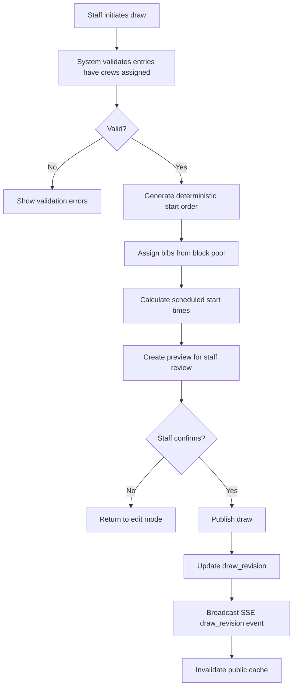

### 2. Result Publishing Flow

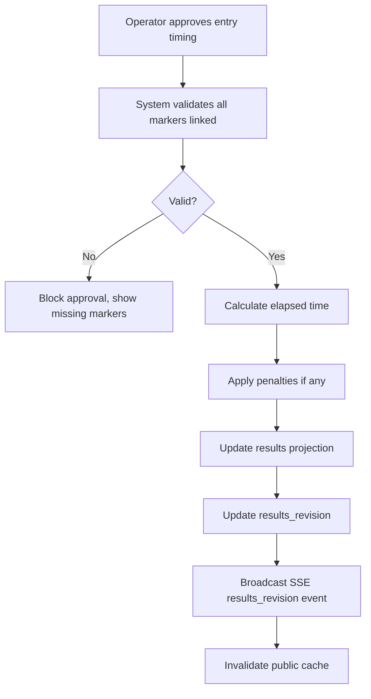

### 3. Investigation Workflow

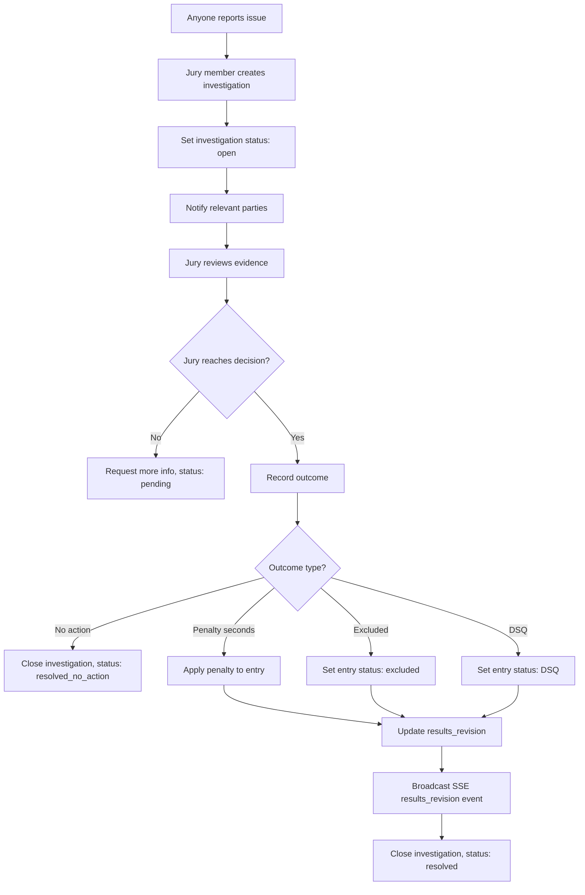

### 4. Operator Handoff PIN Flow

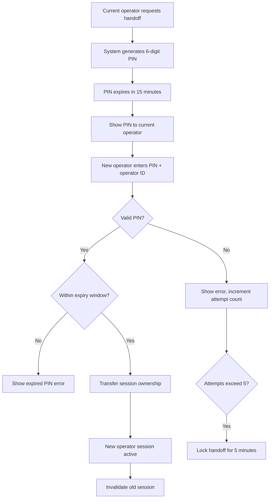

### 5. Offline Sync Conflict Resolution UI Flow

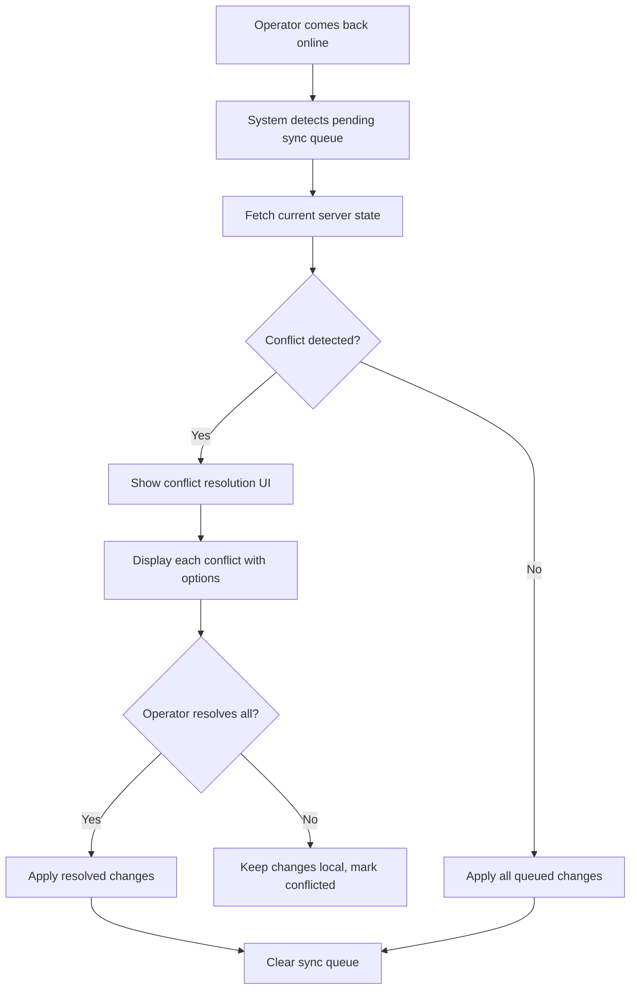

## Testing Strategy

### Test Coverage Targets

| Test Type | Coverage Target | Description |
|-----------|-----------------|-------------|
| Unit tests | 80% | Core business logic, validation rules |
| Integration tests | 60% | API endpoints, database operations |
| Contract tests | 100% | All public/staff API endpoints |
| E2E tests | Critical paths | Key user workflows |

### End-to-End Test Scenarios

**Critical User Journeys:**
1. **Entry Registration**: Create club → Create crew → Create entry → Verify entry appears in list
2. **Draw Generation**: Add entries to event → Generate draw → Publish draw → Verify public draw updates
3. **Timekeeping Flow**: Operator links marker → Approves entry → Results calculate correctly
4. **Investigation Workflow**: Create investigation → Add evidence → Assign penalty → Verify results update
5. **Offline Sync**: Queue marker while offline → Come online → Sync succeeds → No conflicts

**E2E Test Tools:**
- Frontend: Playwright for Vue.js E2E tests
- Backend: JUnit + Testcontainers for integration tests
- Contract: Pact for API contract testing

### Load Test Specifications

| Scenario | Virtual Users | Ramp-up | Duration | Target |
|----------|---------------|---------|----------|--------|
| Public read (CDN) | 1000 | 2 min | 10 min | < 200ms P95 |
| SSE connections | 500 | 1 min | 10 min | < 100ms connection time |
| Staff API write | 50 | 1 min | 5 min | < 500ms P95 |
| Concurrent operators | 20 | 30s | 5 min | Offline sync succeeds |

**Load Test Tools:**
- API: k6 or Gatling
- SSE: custom script to validate connection lifecycle
- Results validation: response times, error rates, SSE tick frequency

### Testing Pyramid
```
        /\
       /  \
      / E2E \
     /--------\
    /Integration\
   /--------------\
  /    Unit Tests   \
 /------------------\
```

- Unit tests: Fast, isolated, high coverage
- Integration tests: Test component interactions
- E2E tests: Critical user journeys only

## Edge Case Handling

### Bib Pool Exhaustion
- **Scenario**: All bibs in the assigned pool are used
- **Handling**: Automatically borrow from next priority pool
- **Error**: If all pools (including overflow) are exhausted, reject with `BIB_POOL_EXHAUSTED` (409)
- **Recovery**: Admin must add more bibs to overflow pool or unpublish draw to redistribute

### Draw Publish Failure Recovery
- **Scenario**: Draw publish fails midway (network error, timeout)
- **Handling**: Transaction rollback; draw remains in draft state
- **Recovery**: Retry publish; if persistent failure, check server logs for specific error
- **Audit**: Failed publish attempts logged to event store

### DSQ Revert for Multiple Penalties
- **Scenario**: Entry has multiple penalties applied; one penalty is overturned
- **Handling**: Recalculate elapsed time without the overturned penalty
- **UI**: Show entry as "under investigation" until all penalties resolved
- **Audit**: Original penalty remains in audit log with status "overturned"

### Race Condition Handling for Concurrent Marker Linking
- **Scenario**: Two operators try to link different markers to the same entry simultaneously
- **Handling**: Last-write-wins with timestamp resolution
- **Validation**: Check entry not already approved/immutable
- **Conflict**: If both operators link to same marker, second operator gets `CONFLICT` error
- **Prevention**: UI shows "locking" state when operator selects entry

### Additional Edge Cases

| Edge Case | Severity | Handling |
|-----------|----------|----------|
| Athlete belongs to multiple clubs | Warning | Require explicit club assignment |
| Crew has no athletes | Error | Block entry creation |
| Duplicate federation ID | Error | Reject with validation error |
| Entry status conflict (approved + withdrawn) | Error | Reject, show current status |
| SSE connection timeout during publish | Warning | Client reconnects with exponential backoff |
| Offline sync queue overflow | Warning | Oldest actions evicted, alert admin |
| Capture session time drift > threshold | Error | Mark session as unsynced, require review |
| Payment for already-paid entries | Error | Reject, show invoice status |

### Recovery Procedures

| Scenario | Recovery Action | Authority |
|----------|-----------------|-----------|
| Bib exhaustion | Add to overflow pool | regatta_admin |
| Draw publish failure | Retry or rollback | regatta_admin |
| Marker linking conflict | Manual review | operator, regatta_admin |
| DSQ revert | Reinvestigate | head_of_jury |
| Payment errors | Manual reconciliation | regatta_admin |

## State Diagrams

### Entry Lifecycle State Machine

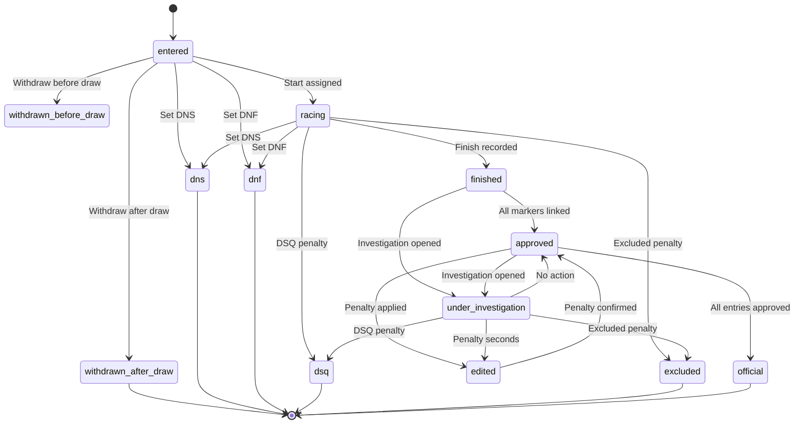

### Regatta State Transitions

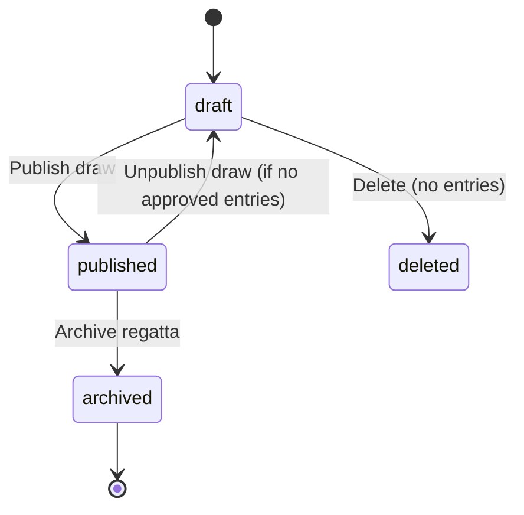

### Investigation Flow State Machine

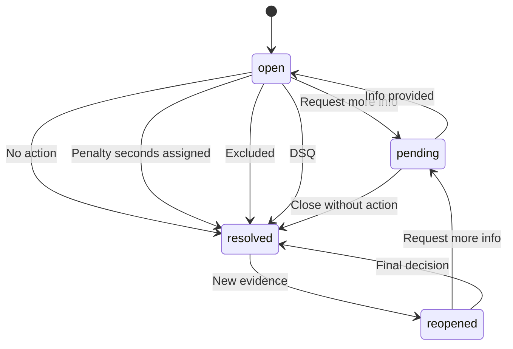

### Marker Lifecycle

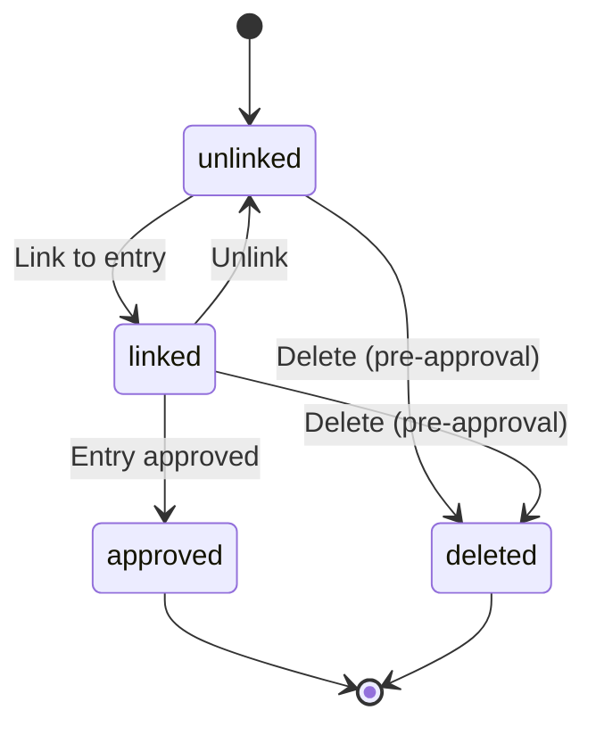

### Operator Session State

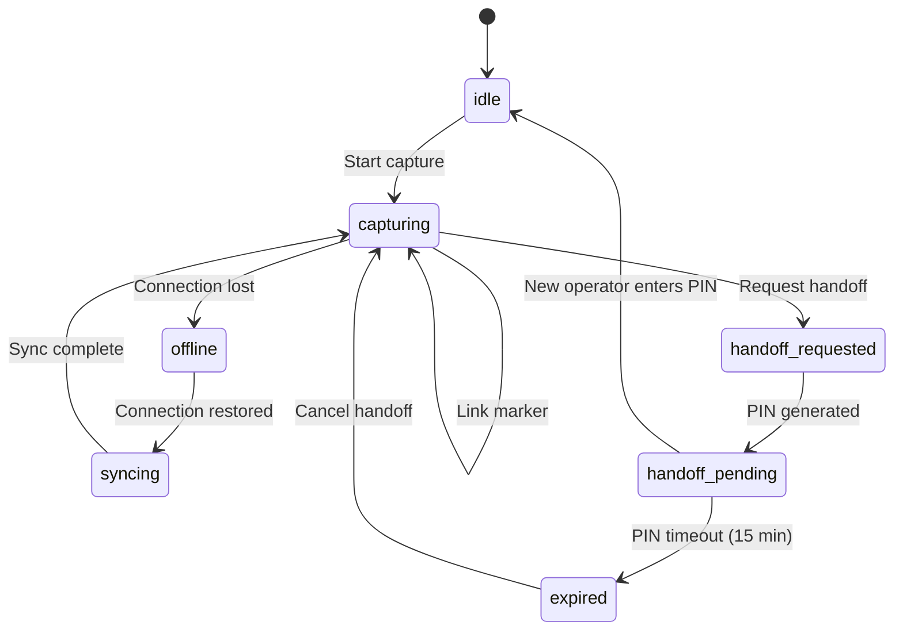
