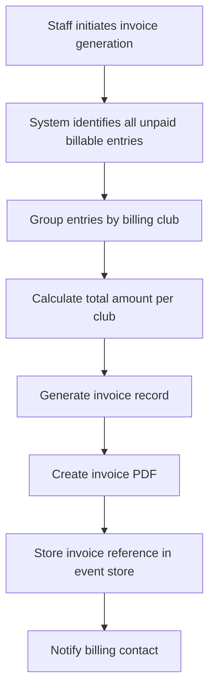

Version: v2
Last Updated: 2026-02-06
Author: RegattaDesk Team

# RegattaDesk v0.1 Detailed Design

## Overview
RegattaDesk is a regatta management system for rowing head races (single distance) that supports:
- staff workflows (entries, draw, bibs, jury, finance),
- operator workflows (start/finish timekeeping with line-scan camera UI, offline-capable),
- a high-traffic public read site with cacheable pages and live updates.

Backend: Quarkus (Java) + Postgres. Frontend: Vue.
Architecture adopts Event Sourcing + projections for read models and public delivery.
API-first for all operations; staff/operator/public clients consume the same API surface (imports can be external tools later).

## Detailed Requirements
(See idea-honing.md for consolidated requirements. This design is standalone, but references the same decisions.)

### Functional
- Terminology (glossary; use consistently in this doc):
  - Category: demographic grouping (age/gender/skill level).
  - Boat type: shell/rigging type (e.g., 1x, 2x, 2-, 4+, 8+).
  - Event: a Category × Boat type pairing; primary unit for entries, scheduling, and results.
  - Event group (optional): named grouping of events for awards or schedule organization (avoid using “class” as a standalone term).
  - Block: operational scheduling unit with an ordered list of events.
- Regatta setup: events (with optional event grouping), blocks, bib pools (multiple per block), overflow pool, display prefs (per-entry vs block-only start time), penalties (seconds configurable per regatta), ruleset selection.
- Regatta state lifecycle: draft → published (draw published) → archived → deleted.
- Blocks: schedule start time plus interval between crews and interval between events (block-level config).
- Regatta end definition (for retention windows): use explicit regatta_end_at timestamp when set; otherwise compute from the latest block’s scheduled end time.
- Scheduled start time (deterministic):
  - per-entry scheduled_start = block_start + (event_index * event_interval) + (crew_index_within_event * crew_interval)
  - indices are zero-based in draw order; event order is the block’s event sequence, crew order is the event draw order
- Block scheduled end time (best practice): block_end = last_scheduled_start + crew_interval.
  - Equivalent formula for final crew: block_end = block_start + (event_index * event_interval) + (crew_index_within_event * crew_interval) + crew_interval
- Entries/crews/athletes: CRUD via API; crew reusable across regattas; entry is regatta-scoped participation.
  - Club fields: id, name, short_name.
  - Athlete fields: first_name, middle_name (optional), last_name, DOB, gender, club, optional federation id.
    - Federation ID format: alphanumeric, max 20 chars; optional field for national federation integration.
    - Athlete search supports filtering by federation ID (documented in the OpenAPI contract).
  - Crew fields: display name; explicit club assignment when provided, otherwise derived from athletes; list of athletes + seat order.
    - Derived club rule: if all athletes share the same club, use that club; otherwise mark crew as composite/multi-club.
  - Entry fields: bib, start position, status.
- Events: category × boat type; may be grouped into event groups per regatta.
- Rulesets: versioned; can be duplicated and updated; global rulesets immutable once linked to a regatta with a published draw; regatta cannot change ruleset after draw; age calculation config (actual age at start vs age as of Jan 1).
  - Only super_admin can promote regatta-owned rulesets to global selection.
  - Validation checks: gender compatibility and min/max age constraints.
- Finance: payment_status enum (v0.1) is `unpaid` or `paid` only (no partial/refund support); default is `unpaid`.
  - Payment amount configuration: entry fee is configurable per regatta (default €0.00); stored in regatta configuration.
  - Club-level billing: configurable billing contact and invoicing details per club.
  - Entry-level status is the source of truth.
  - Club “paid/unpaid” is a bulk action that updates entries with audit events.
  - Club status is derived from current entry statuses (paid only if all current billable entries are `paid`; otherwise `unpaid`).
  - Optional payment metadata fields: paid_at, paid_by, payment_reference.
  - Billing club source of truth: entry.billing_club_id when set; otherwise crew’s club (single-club crews only).
  - Composite/multi-club crews require explicit billing_club_id (and remain labeled as composite for reporting).
  - API validation: create/update entry rejects composite/multi-club billing without `billing_club_id` using `400 BILLING_CLUB_REQUIRED_FOR_COMPOSITE_CREW`.

### Payment Workflow

#### Invoice Generation Flow


#### Invoice Schema
```json
{
  "id": "uuid",
  "regatta_id": "uuid",
  "club_id": "uuid",
  "invoice_number": "string",
  "entries": [{"entry_id": "uuid", "amount": number}],
  "total_amount": number,
  "currency": "string",
  "status": "draft|sent|paid|cancelled",
  "generated_at": "timestamp",
  "sent_at": "timestamp",
  "paid_at": "timestamp"
}
```

#### Payment Reconciliation Process
1. Manual payment entry: Staff records payment details via API
2. System validates: invoice exists, amount matches
3. Update payment status: mark entries as `paid`
4. Audit event: record who marked paid, when, payment reference
5. Update club status: recalculate based on all entries

#### Refund Handling
- **Refunds are NOT supported in v0.1**
- Manual workarounds require admin intervention and database access
- Future consideration: credit notes system for post-v0.1

#### Payment API Endpoints
All payment endpoints, methods, parameters, and schemas are defined in `pdd/design/openapi-v0.1.yaml`.

- Draw: random v0.1, stored seed for reproducibility, publish increments draw_revision; no insertion after draw; events start sequentially but finishes can interleave.
  - Bib pools are immutable after draw publish. To change pools, unpublish draw first.
  - Draw generation uses the bib pool allocation algorithm. If a pool is exhausted, continue to the next pool. If overflow is exhausted, throw error.
- Bibs: regatta-wide unique; collision resolution assigns next available bib to changing entry; missing bib replacement affects only that entry; default assignment direction (smallest/largest) configurable per regatta (no per-pool override in v0.1); blocks can have multiple bib pools; overflow pool usage bounded by physical inventory.
  - Pools/overflow must be defined as non-overlapping inclusive numeric ranges (or explicit lists); validate uniqueness across all pools at setup.
  - Allocation priority: use the entry’s block primary pool first, then additional block pools in configured order, then overflow.
  - Next available bib = first unused number in the current pool when scanning in the configured direction; if exhausted, continue to the next pool in priority order.
  - Overflow pool is regatta-level and shared across all blocks; any block may borrow from it.
- Timing: line-scan markers create/move/delete; link/unlink to bib; immutability after approval.
  - UI: overview strip plus draggable detail window for fine alignment at start/finish.
  - Selecting an unlinked marker recenters the detail view on that marker.
  - Capture metadata: recording start time + fps; compute time from frame offset.
  - Recording start time sourced via device time sync at session start (server handshake/NTP); store server_time_at_start plus device monotonic offset.
  - Drift handling: periodic resync; apply offset correction; if drift exceeds threshold, flag the capture session for review.
  - Fallback: if device time is invalid or sync fails, mark the capture session as unsynced and require manual timestamp correction before approvals (server-received timestamps are provisional only).
  - Time storage (best practice): regatta.time_zone stored as IANA TZ name (e.g., `Europe/Amsterdam`); store timestamps in UTC (Instant) and display in regatta-local time zone.
  - Marker metadata: timestamp, capture device id, image tile reference (tile coords/ids).
  - Tile defaults (best practice): 512x512 WebP lossless tiles with PNG fallback; manifest includes tile size, origin, and x-coordinate -> timestamp mapping.
  - Unlinked marker create/delete is not audited.
  - Link/unlink actions and edits to linked markers are always audited.
  - Pre-approval deletes of linked markers emit audit events.
  - Linked markers become immutable after approval.
  - Retention: keep full line scan during regatta; after configured delay (default 14 days after regatta end, configurable per regatta) prune to ±2s around approved markers. (Regatta end defined above.)
    - Do not prune until the regatta is archived or all entries are approved.
    - If the retention delay elapses first, keep the full scan and raise an admin alert.
  - Result calculation: use actual start + finish markers only (no scheduled-time fallback).
  - Public results ordering (best practice):
    - Rank by elapsed time including penalties.
    - Ties share rank.
    - Tie-breaker order for display: 1) elapsed time (tie), 2) start time, 3) bib number, 4) crew name alphabetically.
    - Non-finish statuses (dns/dnf/dsq/excluded/withdrawn) appear after ranked entries.
  - If a start/finish marker is missing, approval is blocked until the marker is added or the entry is set to DNS/DNF/DSQ/Excluded.
  - Timing precision: store milliseconds.
  - Default display precision: milliseconds (`.mmm`).
  - Rounding rule: round half-up to the configured precision for display; ranking uses actual (unrounded) time.
  - Elapsed-time format: `M:SS.mmm` (or `H:MM:SS.mmm` when ≥1h).
  - Scheduled-time format: `HH:mm` (24h).
  - Public results Delta: time behind leader, computed from unrounded times then rounded for display; format `+M:SS.mmm` (or `+H:MM:SS.mmm` when ≥1h).
  - Leader delta displays as `+0:00.000` (rounded) so the UI never shows a blank delta.
- Operator workflow: global queue across blocks (not necessarily draw order); marker→bib linking with quick correction; DNS batch warnings before bulk changes.
- Jury: investigations per entry; outcomes include no action, penalty seconds (configurable per regatta via penalty configuration), excluded, DSQ (entry); approvals gate.
  - Multiple investigations per entry allowed; closure is per investigation.
  - Penalty seconds are added to computed elapsed time for ranking and delta; raw timing data is retained for audit.
  - Penalty configuration (`defaultPenaltySeconds`, `allowCustomSeconds`) is set at the regatta level and used when assigning penalties via investigations.
  - "No action" closes the investigation; workflow: 1) Close investigation with outcome=no_action, 2) System checks if timing is complete, 3) If yes and no other open investigations, auto-approve entry, 4) If no, entry returns to pending_approval.
  - Tribunal escalation is modeled by re-opening an investigation.
  - Not all entries in a single investigation must receive penalties.
  - Best practice: regatta-wide DSQ is modeled as a bulk action applying DSQ (entry) to all affected entries, with per-entry audit events.
- Approvals/results: entry completion criteria, event approval gating (withdrawn entries excluded), DSQ as a canonical status with explicit revert event storing prior status in metadata; result labels provisional/edited/official.
  - Entry completion: finish time set OR status dns/dnf/dsq/excluded and not under investigation.
  - Entry approval is explicit (head_of_jury or regatta_admin):
    - When timing is complete and there are no open investigations, entry becomes “pending approval”.
    - Approving an entry marks it `approved/immutable` and locks linked markers.
  - Event cannot be approved unless every non-withdrawn entry is in approved/dns/dnf/dsq/excluded state.
  - withdrawn_before_draw entries are excluded from public schedule/results entirely; show only in staff views with filters/audit history.
  - withdrawn_after_draw entries remain visible on staff/public schedules and results with a withdrawn status label; they are excluded from rankings and approvals.
  - If a required start/finish marker is missing, approval is blocked unless the entry is set to DNS/DNF/DSQ/Excluded.
  - Result labels:
    - provisional: computed but not event-approved
    - edited: manual adjustment or penalty applied (still provisional until approval)
    - official: event approved
- Public: cacheable versioned paths with draw/results revision keys; /versions no-store; SSE ticks and snapshot.
  - Schedule/start order content depends only on draw_revision, even though cache keys include both revisions.
  - Revision bump rules (best practice):
    - draw_revision: draw publish + any schedule/start-order/bib display change
    - results_revision: marker/time edits, penalties, approvals, DNS/DNF/DSQ/excluded changes
    - if a single operation affects both schedule/start-order/bib display and result-affecting data, increment both together

### Status taxonomy
- Domain status values: entered, withdrawn_before_draw, withdrawn_after_draw, dns, dnf, excluded, dsq.
  - `excluded` - entry was disqualified from the race (not the same as DSQ which is entry-level ban).
- Derived workflow/UI states: under_investigation, approved/immutable, offline_queued, provisional/edited/official.

### Non-functional
- Primary database: PostgreSQL (v16+ in v0.1 baseline).
- Operator offline: queued actions; sync with explicit conflict policy.
  - Queue data structure: array of {action, timestamp, device_id, metadata} objects.
  - **Queue size limits**: Max 1000 actions per device; oldest actions evicted when limit exceeded.
  - **Retry strategy for sync failures**:
    - Exponential backoff: 1s, 2s, 4s, 8s, 16s, 32s, capped at 60s
    - Max retry attempts: 10 per action batch
    - After max retries: mark batch as "failed", UI shows sync error state
    - User can manually retry failed batches
  - **Offline duration tracking**:
    - Track offline_start_timestamp when connection lost
    - Track last_successful_sync_timestamp
    - Display offline duration in UI when disconnected
    - Flag for admin review if offline duration > 1 hour
  - Sync API accepts queued actions and returns conflict results.
  - Conflict resolution: last-write-wins for marker position/time adjustments and unlinking when entry is not approved; auto-accept link if entry has no linked marker at that station and marker is not linked elsewhere.
  - Manual resolution required: duplicate links (entry already linked to a different marker), marker linked to a different entry, or any edits against approved/immutable entries (reject and surface conflict).
  - Conflict API exposes pending conflicts with resolution options.
- High read scalability: CDN caching + versioned paths + SSE ticks.
- Containerized deployment via Docker Compose for both local and production in v0.1, with complete runtime dependency coverage (backend, frontend, PostgreSQL, Traefik, Authelia); Authelia runs in DB-only backing mode in v0.1 (no Redis) + automated pipeline (CI/CD).
- Observability: health + OpenTelemetry + metrics.
- Audit: event sourcing + immutable log.

### Out of scope (v0.1)
- Side-by-side racing, multi-distance, handicap/conversion factors (beyond “winner time” ranking).
- OCR bib recognition.
- Built-in CSV import UI (API-only; import tools later).

## Architecture Overview

```mermaid
flowchart LR
  subgraph Clients
    Staff[Staff Web (Vue)]
    Ops[Start/Finish Operator PWA (Vue)]
    Public[Public Web (Vue)]
  end

  subgraph Edge
    RP[Traefik Reverse Proxy]
    SSO[Authelia ForwardAuth]
    CDN[CDN/Cache]
    SSE[SSE Gateway (HTTP)]
  end

  subgraph Backend[Quarkus Backend]
    API[REST API]
    CMD[Command Handler]
    ES[Event Store (Postgres)]
    PROJ[Projectors]
    RM[(Read Models / Projections)]
    OBJ[(Object Storage: tiles + manifests)]
  end

  Staff --> RP --> SSO --> API
  Ops --> RP --> API
  Public --> CDN --> RP --> API
  Public --> SSE --> RP --> API

  API --> CMD --> ES
  ES --> PROJ --> RM
  API --> RM

  Ops --> OBJ
  API --> OBJ
```

## Frontend UX and design system
- v0.1 style and component specs are defined in `style-guide.md`.
- Design system approach:
  - CSS variables as the canonical token layer.
  - Headless Vue components for reuse across Staff/Operator/Public.
  - Theme/density controlled via `<html>` attributes (e.g. `data-contrast`, `data-density`).
- Public accessibility target: WCAG 2.2 AA minimum; aim AAA where feasible for key schedule/results flows.
- Staff accessibility: no hard requirement, but avoid obviously inaccessible patterns (focus visibility, contrast, touch targets).
- Internationalization and formatting:
  - Initial locales: Dutch (`nl`) and English (`en`).
  - Time: 24h.
  - Dates in technical docs and APIs: ISO 8601 `YYYY-MM-DD`.
  - UI display date format is locale-dependent (default `nl`: `DD-MM-YYYY`, `en`: `YYYY-MM-DD`).
  - Time zone: regatta-local (future may add viewer-local toggle).
- Notifications (email templates):
  - Template id convention: `{event}.{locale}.{variant}` (example: `invoice_ready.en.default`).
  - Variable interpolation syntax: double curly braces with dot paths, e.g. `{{regatta.name}}`, `{{invoice.total_amount}}`, `{{recipient.display_name}}`.
  - Missing variables are validation errors at template publish time; sending with unresolved variables is rejected with `400 TEMPLATE_RENDER_ERROR`.
  - Payload contract:
    - Required: `template_id`, `locale`, `to[]`, `variables`
    - Optional: `cc[]`, `bcc[]`, `reply_to`, `attachments[]`
  - Multipart format:
    - Send as `multipart/alternative` with both `text/plain` and `text/html`.
    - Both parts are rendered from the same template variables.
    - HTML part allows a restricted subset of tags (`p`, `a`, `ul`, `ol`, `li`, `strong`, `em`, `table`, `tr`, `td`) and strips scripts/styles.
  - Internationalization approach:
    - Locale resolution order: explicit `locale` in request, recipient profile locale, regatta default locale.
    - Fallback: if localized template variant does not exist, use `en` variant with same template id.
    - Date/time and currency values are formatted at render time using locale + regatta time zone.
  - Versioning and audit:
    - Templates are immutable after publish; edits create a new template version.
    - Each send stores `template_id`, `template_version`, locale, recipient list, and render timestamp in audit log.
- Printing:
  - Admin generates printables as A4 PDFs; monochrome-friendly output.
  - **PDF library selection**: OpenPDF (LGPL) for Java backend; supports A4, monochrome output, custom fonts.
  - **Async job status polling**:
    - Print export uses an async job model with a returned `job_id`.
    - Job status includes `pending|processing|completed|failed`, optional `download_url`, and optional `error`.
    - Job expires after 24 hours.
  - **Print template specifications**:
    - Page size: A4 (210mm x 297mm)
    - Margins: 20mm top/bottom, 15mm left/right
    - Header (per page): regatta name, generated timestamp, draw/results revisions, page number
    - Font: Liberation Sans (free, readable)
    - Monochrome: Grayscale only, minimum 300 DPI
    - Content sections: draw list, results, entries by event
    - Footer: regattadesk logo/wordmark
  - Print generation: async processing via background queue (for large regattas).
- Operator UX constraints:
  - Must remain usable on iPhone SE class devices.
  - Must support outdoor readability via high contrast and larger touch targets.
  - Default to high-contrast mode with a toggle back to standard; persist preference per device (LocalStorage).
  - Density toggle: persist per device via LocalStorage (compact/dense modes).
  - PIN/token flows must not interrupt active capture UI.

## Components and Interfaces
- Staff API: Traefik-forwarded identity (Authelia SSO), regatta-scoped roles (+ super_admin).
  - Contract details (security schemes, headers, and endpoint-level auth) are defined in `pdd/design/openapi-v0.1.yaml`.
  - Role model: regatta_admin, head_of_jury, info_desk, financial_manager; super_admin is global.
  - Forwarded headers: `x_forwarded_user` (required), `x_forwarded_groups` (optional), `x_regatta_roles` (optional), `x_global_roles` (optional).
  - Operator capabilities are token-scoped (QR/PIN) and are not part of the staff JWT role set.
- Operator API: QR token scoped to block(s), station, validity window, revocable; operators are accountless (QR/token only).
  - Station model: single active station per token; second device can request access without interrupting active station.
  - Handoff: new device shows a PIN; active station can reveal the matching PIN to complete handover.
  - After PIN handover, the previous device is demoted to read-only and must re-auth to regain control.
  - Admin can view PIN remotely in case the active station cannot access the PIN flow.
  - Token display must not interrupt capture UI (hidden unless opened intentionally).
  - QR tokens exportable to PDF with fallback instructions (short URL + token/PIN) if QR scan fails.
- Public:
  - Endpoint contracts are defined in `pdd/design/openapi-v0.1.yaml`.
  - Public session behavior:
    - Missing or invalid anon cookie issues a new session.
    - Valid cookie refreshes only within the refresh window; otherwise no cookie rotation.
    - Sliding TTL is 5 days; refresh window is 20% of TTL.
    - Key rotation uses two active keys with >=6-day overlap.
    - Cookie policy is HttpOnly + Secure + SameSite=Lax.
  - Bootstrap order: versions check first, then session establishment on auth failure, then retry, then open SSE.
  - SSE event types:
    - `snapshot` - initial state on connect (contains full regatta data needed for public display only)
    - `draw_revision` - draw-related changes (schedule, start order, bibs)
    - `results_revision` - results-related changes (times, penalties, approvals, status changes)
  - Multiplexed by event type (event: snapshot, draw_revision, results_revision).
    - Deterministic SSE id includes draw_revision + results_revision.
    - Per-client cap: 20 concurrent connections per client-id per regatta.
    - Reconnect: exponential backoff with full jitter; min 100ms, base 500ms, cap 20s; retry forever.
    - No per-IP concurrent cap or per-IP rate limiting until measured.
    - UI shows a minimal Live/Offline indicator based on SSE connection state only (no freshness claim).
  - Versioned public delivery:
    - Versioned pages/data are cacheable and fully anonymous.
    - Cache keys include draw_revision + results_revision; client soft-updates and replaces URL to latest version.
    - Schedule/start order content still only changes with draw_revision.
  - withdrawn_after_draw status changes bump both draw_revision and results_revision.

[database-schema.md](database-schema.md)

## Staff API Endpoints

OpenAPI contract source of truth: `pdd/design/openapi-v0.1.yaml`.

This document intentionally avoids duplicating endpoint methods, paths, request/response schemas, and auth/header requirements that are already specified in OpenAPI.

### API Implementation Notes (Non-Contract)
- Staff auth is enforced at the edge with Traefik + Authelia.
- OAuth/OIDC session handling and JWT verification are offloaded to Traefik middleware to reduce backend auth complexity.
- Backend authorization uses trusted forwarded identity/group headers from Traefik and maps them to regatta-scoped roles.
- Operator access is token-scoped (station/block/validity) and accountless; this is separate from staff JWT role assignment.
- Public bootstrap sequence is operationally important: version check, session establishment on auth failure, retry once, then SSE connect.
- Concurrency behavior: write operations that require revision/version preconditions return conflict semantics when stale input is supplied.
